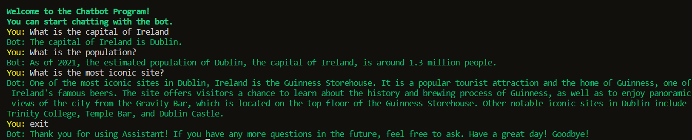

# chatGPT-Chatbot

ChatGPT chatbot using Node.js
Traversy Media Tutorial

This is a terminal based project, which allows the user to have a conversation with a chatbot like chatGPT. The chatbot is aware of the history of the conversation. This is achieved by sending the history of the chat with the new request to OpenAI API



## Initial setup

Get your OpenAI API key at https://platform.openai.com/account/api-keys

Create a file named `.env` and add the following:

```
OPENAI_API_KEY=YOURKEY
```

## Install dependencies:

```
npm init
npm i openai readline-sync dotenv colors
```

### To run

```
npm start
```
